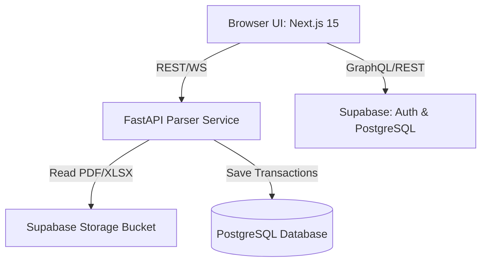

# Fintura: Transaction Intelligence Platform

[](https://nextjs.org/)
[](https://fastapi.tiangolo.com/)
[](https://supabase.com/)
[](https://www.docker.com/)
[](https://github.com/krsna016/fintura/actions/workflows/ci.yml)
[](https://github.com/krsna016/fintura/actions/workflows/codeql.yml)
[](LICENSE)

Fintura (formerly TIP) is an enterprise-grade, commercial SaaS transaction intelligence platform designed to ingest, parse, normalize, and export multi-bank statements into accounting-ready formats (CSV, JSON, QBO). It automates banking ledger ingestion using state-of-the-art PDF parsing, OCR, and heuristic table extraction.

---

## System Architecture

Fintura is built using a modern decoupled monorepo architecture. 



### Monorepo Layout
```text
fintura/
├── apps/
│   ├── web/                     # Next.js 15 App Router Frontend (shadcn/ui, Tailwind)
│   └── parser-service/          # Python 3.12 Document Parsing API (FastAPI, Pandas, pdfplumber)
├── supabase/                    # Supabase Database Migrations & Schemas
├── .github/                     # Automated CI/CD Actions, Dependabot & Issue templates
├── docker-compose.yml           # Unified multi-container deployment configuration
├── Makefile                     # Root development task orchestrator
├── LICENSE                      # Apache-2.0 open-source license
└── README.md                    # Platform documentation (this file)
```

---

## Key Features

- **Document Parser Pipeline:** Ingests bank statement PDFs, extracts transactional tabular data, handles multi-page tables, and resolves running balances.
- **Unified Web Console:** A dashboard to upload files, review transaction items, correct parsed categories, and export records.
- **Robust Database Engine:** Audited PostgreSQL schema running under Supabase, with Row-Level Security (RLS) policies enforcing multi-tenancy bounds.
- **Docker-Compose Ready:** Fully containerized setup enabling a single-command local sandbox deployment.

---

## Technology Stack

### Frontend (`apps/web`)
* Next.js 15 (React 19, App Router)
* TypeScript
* TailwindCSS & shadcn/ui
* Supabase Client SDK

### Backend Parser Service (`apps/parser-service`)
* Python 3.12 & FastAPI
* Pandas & NumPy (data extraction and normalization)
* pdfplumber & OpenPyXL
* Uvicorn & Pytest

---

## Getting Started & Local Setup

### 1. Prerequisites
Ensure you have the following installed:
- Docker & Docker Compose
- Node.js 20+ & npm
- Python 3.12+

### 2. Quickstart Environment Deployment
We utilize a root-level `Makefile` to simplify monorepo control.

```bash
# Install NPM modules and Python backend environments
make install

# Launch web client and parser service concurrently using Docker
make dev
```

The application will launch on:
- Web Frontend: [http://localhost:3000](http://localhost:3000)
- FastAPI Docs (Swagger): [http://localhost:8000/docs](http://localhost:8000/docs)

---

## Environment Variables Configuration

### Frontend (`apps/web/.env.local`)
Create a `.env.local` inside `apps/web` containing:
```env
NEXT_PUBLIC_SUPABASE_URL=your-supabase-project-url
NEXT_PUBLIC_SUPABASE_ANON_KEY=your-supabase-anon-key
```

### Parser Service (`apps/parser-service/app/.env`)
Create an `.env` inside `apps/parser-service/app` containing:
```env
SUPABASE_URL=your-supabase-project-url
SUPABASE_SERVICE_ROLE_KEY=your-supabase-service-role-key
PORT=8000
```

---

## Testing & Linting Pipelines

Run verification tests and syntax format checks from the root folder:

```bash
# Run backend tests
make test

# Verify styling rules and check for lint warnings
make lint

# Auto-format all code
make format
```

---

## Docker Deployment & Production Builds

The root `docker-compose.yml` configures the orchestration details for local testing:

```yaml
version: '3.8'
services:
  web:
    build: ./apps/web
    ports:
      - "3000:3000"
    environment:
      - NEXT_PUBLIC_SUPABASE_URL=${NEXT_PUBLIC_SUPABASE_URL}
  parser-service:
    build: ./apps/parser-service
    ports:
      - "8000:8000"
```

To build production-ready Docker containers manually:
```bash
docker build -t fintura-web ./apps/web
docker build -t fintura-parser ./apps/parser-service
```

---

## Security Policies
We enforce Row-Level Security (RLS) across all Supabase schemas to prevent cross-tenant exposure. Static security scans are run weekly using **GitHub CodeQL** and dependency audits via **Dependabot**. For reporting security bugs, see our [SECURITY.md](SECURITY.md) guidelines.

---

## License
This project is licensed under the **Apache License 2.0**. For details, view the [LICENSE](LICENSE) file.
