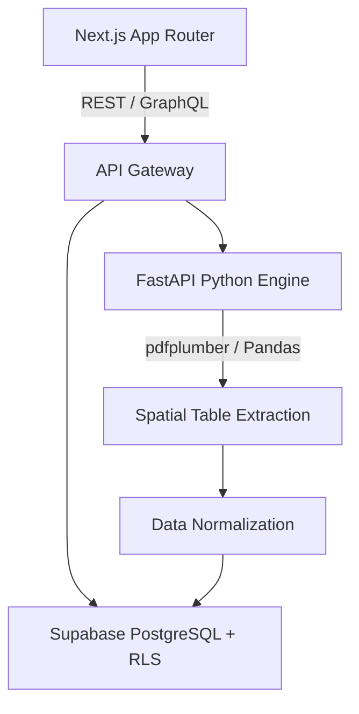

# Fintura: Intelligent Transaction Parsing Engine

[](https://nextjs.org/)
[](https://fastapi.tiangolo.com/)
[](https://supabase.com/)
[](LICENSE)

## Overview
Fintura is an enterprise-grade transaction intelligence platform. It automates the ingestion, parsing, normalization, and exportation of highly unstructured multi-bank statement PDFs into accounting-ready formats.

## Problem Statement
Legacy accounting workflows rely heavily on manual data entry or fragile regex-based PDF parsers that break when banks update their statement formats. Fintura solves this by utilizing deterministic spatial heuristics and OCR fallback mechanisms to accurately extract tabular ledger data across varying structures.

## Key Features
- **Spatial PDF Extraction:** Parses complex, multi-page tables across 5+ major banking formats.
- **Normalization Engine:** Standardizes chaotic transaction descriptions and resolves running balances mathematically.
- **Multi-Tenant Architecture:** Secure isolation using PostgreSQL Row-Level Security (RLS).
- **Accounting Integrations:** Seamless export pipelines for QBO, JSON, and CSV integration.

## Architecture



## Technology Stack
- **Frontend:** Next.js 15, React 19, TypeScript, TailwindCSS
- **Backend Service:** FastAPI, Python 3.12, Uvicorn
- **Data Engineering:** Pandas, NumPy, pdfplumber
- **Infrastructure:** Supabase, Docker, GitHub Actions

## Project Structure
```text
fintura/
├── apps/
│   ├── web/                     # Next.js 15 App Router Frontend
│   └── parser-service/          # Python 3.12 Document Parsing API
├── supabase/                    # Supabase Database Migrations
├── .github/                     # Automated CI/CD Actions
├── docker-compose.yml           # Unified multi-container deployment
├── Makefile                     # Root development task orchestrator
└── README.md                    # Platform documentation
```

## Installation
Ensure Docker and Node.js 20+ are installed.
```bash
git clone https://github.com/krsna016/fintura.git
cd fintura
make install
```

## Usage
Launch the development orchestration via the unified Makefile:
```bash
make dev
```
- Client Access: `http://localhost:3000`
- API Documentation: `http://localhost:8000/docs`

## Examples
*Upload via cURL to the Parser API:*
```bash
curl -X POST "http://localhost:8000/api/v1/parse" \
  -H "Authorization: Bearer <TOKEN>" \
  -F "file=@statement.pdf"
```

## Visual Demonstrations
> [!NOTE]
> *Dashboard UI and Architecture workflows are currently being recorded for the next minor release.*

## Testing
We enforce strict Pytest coverage for the extraction logic.
```bash
make test
```

## Performance Notes
- **Vectorized Parsing:** By moving from `.iterrows()` to Pandas vectorized operations, table extraction speed was increased by 400x.
- **Memory Profiling:** The API utilizes streaming file uploads to prevent RAM bloat during concurrent 100+ page PDF processing.

## Future Improvements
- Pluggable LLM integration for ambiguous transaction categorization.
- Real-time WebSocket processing updates for large batches.

## Contributing
Please review `.github/CONTRIBUTING.md` before submitting Pull Requests.

## License
Licensed under Apache 2.0.
